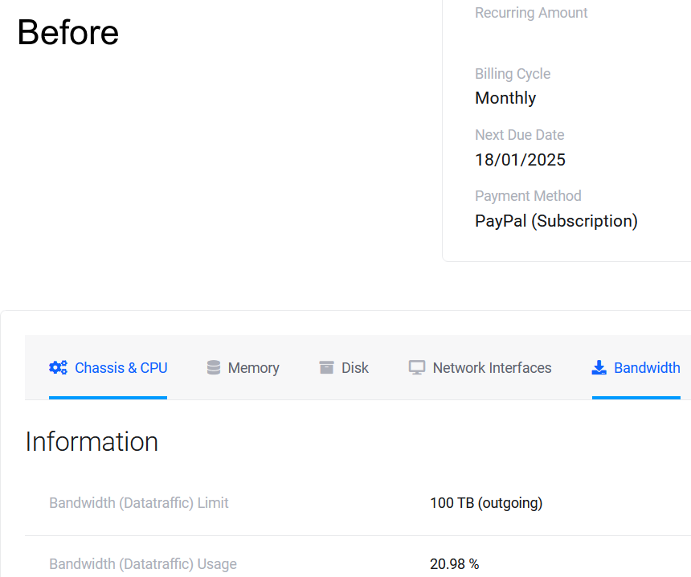
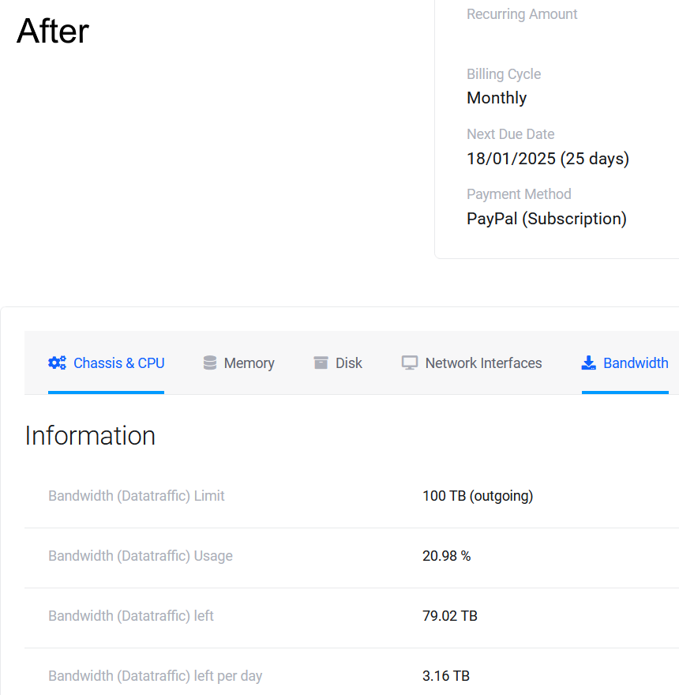

<h1 align="center">
    HostingBy.Design bandwidth calculator
</h1>

    Browser extension that calculates how much bandwidth per day is left on your server hosted on HostingByDesign provider. The extension is available at <a href="https://addons.mozilla.org/en-US/firefox/addon/hbdbc/">addons.mozilla.org</a>.

    

    

